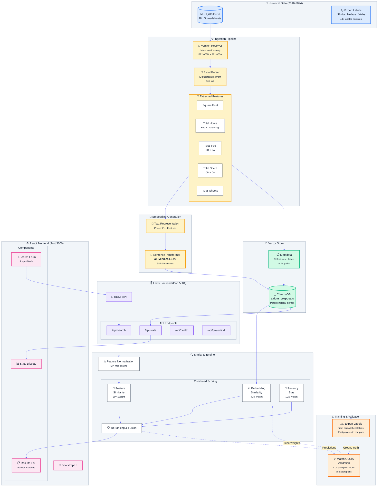

# Axiom Intelligent Proposal Assistant - System Architecture

## Component Details

### Data Layer
| Component | Technology | Purpose |
|-----------|------------|---------|
| Excel Spreadsheets | `.xlsx` files | Historical bid proposals (2016-2024) |
| Version Resolver | Python | Select latest version of each proposal |
| Excel Parser | `openpyxl` | Extract features from first tab |

### ML/AI Layer
| Component | Technology | Purpose |
|-----------|------------|---------|
| Embeddings | `sentence-transformers` | Generate 384-dim semantic vectors |
| Vector Store | ChromaDB | Persistent vector similarity search |
| Similarity Engine | Custom Python | Multi-factor ranking (embed + features + recency) |

### Application Layer
| Component | Technology | Purpose |
|-----------|------------|---------|
| Backend API | Flask + CORS | REST endpoints for search & stats |
| Frontend | React + Bootstrap | User interface for searches |

### Training & Validation
| Component | Source | Purpose |
|-----------|--------|---------|
| Expert Labels | Spreadsheet tables | Ground truth for similar projects |
| Validation | Comparison | Measure prediction vs expert agreement |

## Data Flow Summary

1. **Ingestion**: Excel files → Version resolution → Feature extraction → Embedding → ChromaDB
2. **Search**: User input → API → Similarity scoring → Ranked results
3. **Training**: Expert labels from spreadsheets validate and tune similarity weights
